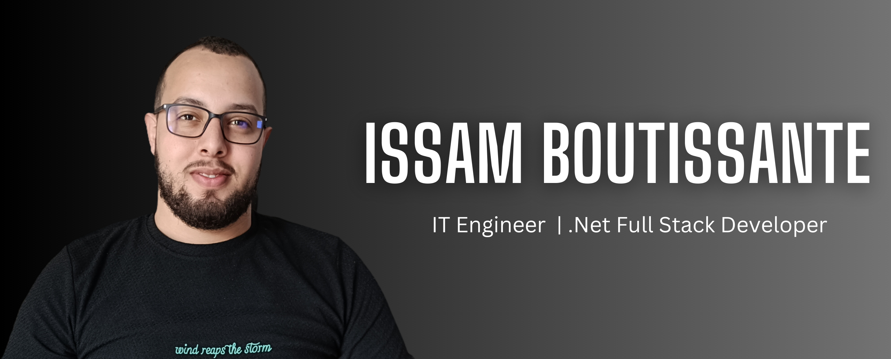

## Hi there 👋

I'm **Issam Boutissante**, an IT Engineer and Full Stack .NET Developer with over 4 years of experience in .NET and Azure Cloud Development. I specialize in building robust and scalable desktop applications using a variety of technologies.

### 💼 Professional Experience

- **Visiativ (03/2024 – 07/2024)**

  - Designed and implemented Single Sign-On (SSO) infrastructure.
  - Developed Windows shell extensions with .NET Core.
  - Migrated legacy Office add-ins to Office 365.

- **Fiverr (09/2021 – Present)**

  - Migrated systems to Airtable, optimizing structures and automations.
  - Integrated APIs like Zapier and Integromat.
  - Developed Windows and mobile apps using WPF and .NET MAUI.
  - Created secure APIs with ASP.NET.

- **Well2Wise (11/2022 – 11/2023)**
  - Led project infrastructure development and system architecture.
  - Managed Azure resources and developed apps using .NET MAUI and ASP.NET MVC.

### 🛠 Skills

- **Languages:** C#, JavaScript, Python, C++, Java
- **SPA Frameworks:** Blazor WASM, Angular, React
- **Backend:** ASP.NET MVC, ASP.NET WEB API, Blazor Server, Entity Framework, Microservices, Unit Testing
- **Desktop:** WPF, WinForms, Avalonia UI, .NET MAUI
- **Databases:** MSSQL, Oracle, MySQL, MongoDB
- **Azure:** VMs, API Management, Event Grid, Key Vault, Azure Storage, Communication Services, B2C, SendGrid, Computer Vision, App Services, Azure SQL Database
- **DevOps:** Git, GitHub, GitHub Actions, Azure DevOps, Docker, Kubernetes

### 🎓 Education

- **EMSI:** IT and Networks Engineering

### 📜 Certifications

- Machine Learning with Python (IBM)
- Azure AD and Azure B2C (Udemy)
- Android App Development Specialization (Vanderbilt University)
- DevOps, Cloud, and Agile Foundations Specialization (IBM)

### 🌐 Languages

- **Tamazight and Arabic:** Native
- **French and English:** Fluent

### 📫 How to reach me:

- **Email:** boutissante.issam.dev@gmail.com
- **GitHub:** [github.com/issamBoutissante](https://github.com/issamBoutissante)
- **Fiverr:** [fiverr.com/issamboutissant](https://www.fiverr.com/issamboutissant)
- **LinkedIn:** [linkedin.com/in/issam-boutissante](https://www.linkedin.com/in/issam-boutissante)

I'm dedicated to delivering high-quality, tailored solutions. Let's bring your project to life!
