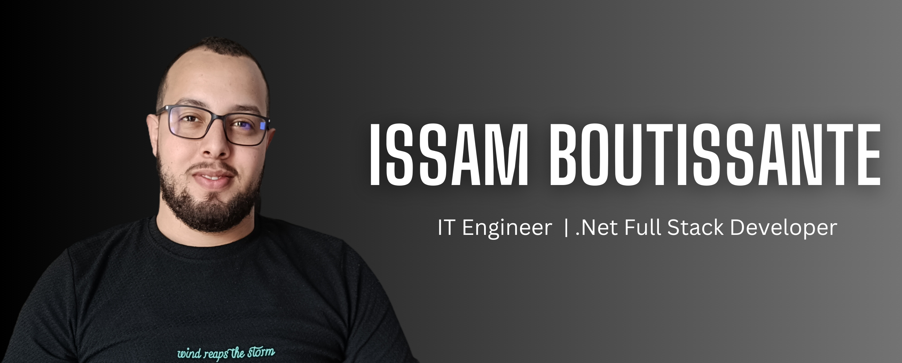

## Hi there 👋

I'm **Issam Boutissante**, an IT Engineer, Full Stack .NET Developer, and Founder of **DIGITAL NAVIGATORS**, with 5+ years of experience in .NET and Azure Cloud Development. I specialize in building robust, scalable desktop, web, and mobile applications.

### 💼 Professional Experience

- **Dispatch Connect Services — Full Stack Engineer** (04/2025 – Present)
  - Building cross-platform applications with .NET MAUI.
  - Implementing identity and access management with Keycloak.
  - Integrating Stripe as a third-party payment service.
  - Contributing to infrastructure design and maintenance.

- **DIGITAL NAVIGATORS — Founder & Software Engineer** (09/2024 – Present) · Marrakech, Morocco
  - Founded a software company delivering tailored full stack solutions for clients worldwide.

- **MAKER.AI — Full Stack Engineer** (08/2024 – 09/2025) · Remote, UK
  - Developed full stack solutions using Blazor, WPF, and related .NET technologies.

- **Fiverr — Full Stack Developer** (09/2021 – 09/2024) · Freelance
  - Migrated company systems to Airtable, optimizing database structures and automations.
  - Integrated external APIs including Zapier and Integromat to streamline workflows.
  - Developed Windows and mobile applications using WPF and .NET MAUI.
  - Created secure and scalable APIs using ASP.NET.

- **Visiativ — Full Stack Developer** (03/2024 – 07/2024) · Marrakech, Morocco
  - Designed and implemented Single Sign-On (SSO) infrastructure across multiple applications.
  - Developed Windows shell extensions (.NET Core) for direct cloud uploads from Windows Explorer.
  - Led the migration of legacy Office add-ins to Office 365 using Office.js.

- **Huggins Venture Group — Full Stack Developer** (10/2023 – 02/2024) · Freelance
  - Developed JavaScript automation scripts for Google Sheets.
  - Built the Hunting Lease App and automated member management using Selenium with Python.
  - Created a macOS app using .NET MAUI for member management.

- **Well2Wise — .NET Developer** (12/2022 – 01/2024) · Remote, Australia
  - Led project infrastructure development and system architecture design.
  - Managed Azure cloud resources, ensuring scalable solutions.
  - Developed applications using .NET MAUI, ASP.NET MVC, Blazor, and ASP.NET API.

- **ProcurementFlow.com — JavaScript Developer** (10/2022 – 01/2023) · Remote, Estonia
  - Enhanced database structures and developed automation scripts for Airtable.
  - Integrated external APIs such as the Salv API.

- **Visiativ — Software Development Intern** (07/2022 – 09/2022) · Marrakech, Morocco
  - Redesigned .NET tools in the Visiativ suite using C# and .NET 6; migrated from VB to C# and .NET Core.
  - Integrated a web browser feature into desktop apps using Chromium Embedded Framework (CefSharp).

- **Regional Directorate of Energy and Mines — .NET Developer** (03/2021 – 09/2021) · Marrakech, Morocco
  - Developed the "Mines Management System" using WPF, Entity Framework, and SQL Server.

### 🛠 Skills

- **Languages:** C#, JavaScript, Python, C++, Java
- **SPA Frameworks:** Blazor WASM, Angular, React
- **Backend:** ASP.NET MVC, ASP.NET Web API, Blazor Server, Entity Framework, Microservices, Unit Testing
- **Desktop & Mobile:** WPF, WinForms, Avalonia UI, .NET MAUI
- **Identity & Auth:** Keycloak, Azure B2C, SSO
- **Databases:** MSSQL, Oracle, MySQL, MongoDB
- **Azure:** VMs, API Management, Event Grid, Key Vault, Azure Storage, Communication Services, B2C, SendGrid, Computer Vision, App Services, Azure SQL Database
- **DevOps:** Git, GitHub, GitHub Actions, Azure DevOps, Docker, Kubernetes

### 🎓 Education

- **EMSI:** IT and Networks Engineering

### 📜 Certifications

- Machine Learning with Python (IBM)
- Azure AD and Azure B2C (Udemy)
- Android App Development Specialization (Vanderbilt University)
- DevOps, Cloud, and Agile Foundations Specialization (IBM)

### 🌐 Languages

- **Tamazight and Arabic:** Native
- **French and English:** Fluent

### 📫 How to reach me

- **Email:** issam@digitalnavigators.tech | boutissante.issam.dev@gmail.com
- **GitHub:** [github.com/issamBoutissante](https://github.com/issamBoutissante)
- **Fiverr:** [fiverr.com/issamboutissant](https://www.fiverr.com/issamboutissant)
- **LinkedIn:** [linkedin.com/in/issam-boutissante](https://www.linkedin.com/in/issam-boutissante)

I'm dedicated to delivering high-quality, tailored solutions. Let's bring your project to life!
